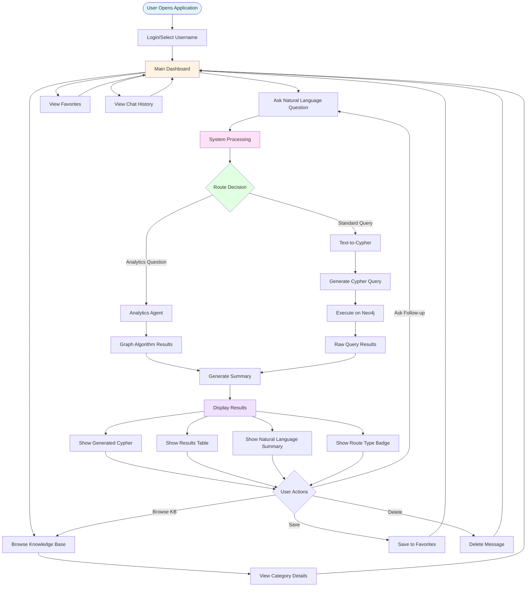
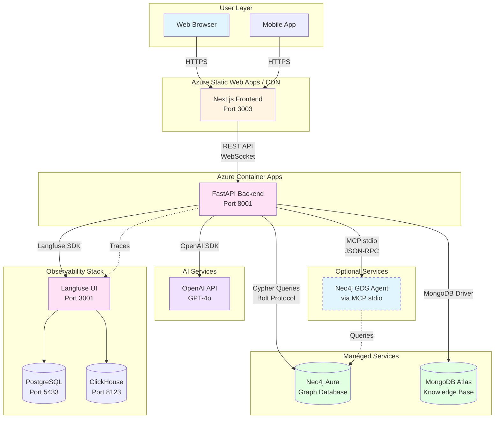
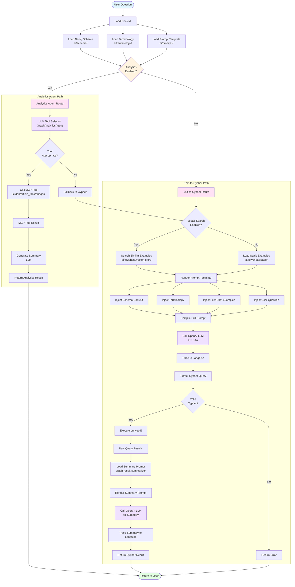

# Architecture Diagrams

This document provides three complementary Mermaid diagrams that illustrate the GraphRAG system from different perspectives:

1. **User Journey Diagram** - Shows the user experience flow and interactions
2. **Cloud Infrastructure Diagram** - Shows deployment architecture and service relationships
3. **AI Implementation Diagram** - Shows the AI/LLM processing pipeline and decision flows

## 1. User Journey Diagram

This diagram illustrates the user's perspective: how they interact with the system, what they see, and the flow of their experience.

## 2. Cloud Infrastructure Diagram

This diagram shows the deployment architecture, cloud services, and how components communicate in a production environment.

## 3. AI Implementation Diagram

This diagram details the AI processing pipeline, showing how natural language questions are transformed into Cypher queries or routed to analytics tools, including all the AI components and decision points.

## Diagram Usage Recommendations

### When to Use Each Diagram

1. **User Journey Diagram**: 
   - Best for onboarding new users
   - Demonstrating the user experience to stakeholders
   - UX/UI design discussions
   - User documentation

2. **Cloud Infrastructure Diagram**:
   - DevOps and deployment planning
   - Infrastructure reviews
   - Cost estimation discussions
   - Security and compliance audits
   - System architecture documentation

3. **AI Implementation Diagram**:
   - Developer onboarding
   - AI/ML team discussions
   - Debugging AI pipeline issues
   - Prompt engineering sessions
   - Performance optimization

### Integration with Documentation

These diagrams complement the existing architecture documentation:

- **User Journey** → See `frontend.md` for component details
- **Cloud Infrastructure** → See `azure-deployment.md` for deployment specifics
- **AI Implementation** → See `ai-stack.md` and `mcp.md` for technical details

### Maintenance

- Update diagrams when adding new user features (User Journey)
- Update diagrams when changing deployment architecture (Cloud Infrastructure)
- Update diagrams when modifying AI pipeline or adding new LLM routes (AI Implementation)

### Exporting Diagrams

To export these diagrams as images:

1. Use Mermaid Live Editor: https://mermaid.live/
2. Copy each diagram code block
3. Export as PNG/SVG
4. Add to documentation or presentations

Alternatively, if using MkDocs with mermaid plugin, these will render automatically in the documentation site.
