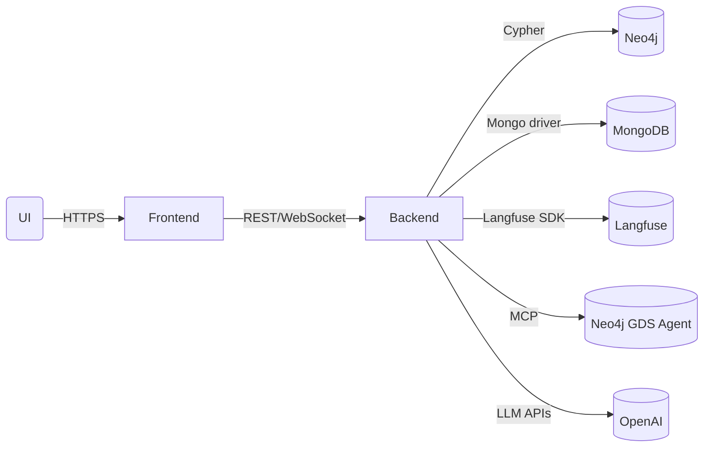

# System Overview

GraphRAG spans four major subsystems:

1. **User Experience** – Next.js app (see `frontend/`) that manages chat flows, query results, and knowledge base navigation.
2. **Application Layer** – FastAPI backend (`backend/app`) that orchestrates conversations, routes graph operations, and exposes REST APIs.
3. **Graph & Knowledge Stores** – Neo4j for graph data, MongoDB for knowledge base content, plus optional Langfuse PostgreSQL/ClickHouse stack for observability.
4. **AI & Automation** – Prompt pipelines, MCP integrations, and graph analytics agents housed under `ai/`.

## Key Responsibilities

- **Frontend**: Collects user input, streams backend responses, visualizes Cypher results, and surfaces progress/status cards for analytics routing.
- **Backend**: Hosts chat endpoints (`backend/app/api/chat.py`), exposes graph metadata (`graph_info.py`), and coordinates agent routing via `backend/app/services/graphrag.py`.
- **AI Layer**: Generates prompts (YAML files in `ai/prompts/`), manages few-shot examples (`ai/fewshots/`), and facilitates MCP sessions (`ai/mcp_client.py`).
- **Observability**: Langfuse traces capture LLM calls, prompt versions, and tool invocations; logs integrate with whichever platform you deploy.

## Deployment Targets

- **Local Dev**: Fully dockerized with `docker-compose.yml` (production mode) or `docker-compose.dev.yml` (hot-reload). Langfuse runs via `docker-compose.langfuse.yml`. Alternative: run services directly (Uvicorn + Next.js dev server) for active debugging.
- **Staging/Prod**: Docker containers deployed to Azure Container Apps. Backend and frontend are separate containers built from `backend/Dockerfile` and `frontend/Dockerfile`. Neo4j (Aura) and MongoDB (Atlas/Cosmos DB) are managed services. GitHub Actions automates Docker build and deployment.

See [Getting Started](../getting-started.md) for local Docker setup and [Azure Production Deployment](../operations/azure-deployment.md) for cloud deployment.

See the dedicated pages for deep dives into each subsystem.

